# Log Classification with Hybrid Framework

Classifies system logs using three complementary approaches: regex for simple patterns, Gemini embeddings + Logistic Regression for complex patterns with training data, and Gemini LLM for sources without enough labeled data (LegacyCRM).

## Architecture

```mermaid
graph LR
    subgraph Input [1. Input]
        CSV["CSV Upload<br>(source, log_message)"] --> Router["classify_log()"]
    end

    subgraph Classification [2. Hybrid Classification]
        Router -->|LegacyCRM source| LLM["☁️ Gemini LLM<br>processor_llm.py<br>(Workflow Error / Deprecation Warning)"]
        Router -->|All other sources| Regex["Regex Patterns<br>processor_regex.py"]
        Regex -->|match found| Label1["Label"]
        Regex -->|no match| Embed["Gemini Embedding<br>gemini-embedding-001"]
        Embed --> LR["Logistic Regression<br>processor_bert.py"]
        LR --> Label2["Label"]
    end

    subgraph Serving [3. API & UI]
        Label1 & Label2 & LLM --> API["⚙️ FastAPI<br>backend/api.py"]
        API --> UI["🖥️ Streamlit UI<br>streamlit_app.py"]
    end

    style Input fill:#e1f5fe,stroke:#01579b
    style Classification fill:#fff3e0,stroke:#e65100
    style Serving fill:#e8f5e9,stroke:#1b5e20
```



## Classification Approaches

| Approach | When Used | Source |
|---|---|---|
| **Regex** | Simple, predictable patterns (backups, logins, file uploads) | All except LegacyCRM |
| **Gemini Embedding + LR** | Complex patterns with enough labeled data | All except LegacyCRM |
| **Gemini LLM** | Unstructured business logic, insufficient training data | LegacyCRM only |

## Model Performance

### Logistic Regression on Gemini Embeddings (Test Set)

| Class | Precision | Recall | F1-Score | Support |
|---|:---:|:---:|:---:|:---:|
| Critical Error | 0.98 | 1.00 | 0.99 | 48 |
| Error | 1.00 | 0.98 | 0.99 | 47 |
| HTTP Status | 1.00 | 1.00 | 1.00 | 304 |
| Resource Usage | 1.00 | 1.00 | 1.00 | 49 |
| Security Alert | 1.00 | 1.00 | 1.00 | 123 |
| **Accuracy** | | | **1.00** | **571** |

- **Test Accuracy: 99.82%** (test size: 30%, random_state=42)
- Embedding model: `gemini-embedding-001` (768 dimensions, task_type=CLASSIFICATION)
- Predictions with max probability < 0.5 fallback to "Unclassified"

## Project Structure

```
log-classification-system/
├── backend/
│   ├── api.py               # FastAPI endpoints
│   ├── classify.py          # Routing logic (which classifier handles each log)
│   ├── processor_regex.py   # Regex-based fast-path classifier
│   ├── processor_bert.py    # Gemini embedding + LR classifier
│   ├── processor_llm.py     # Gemini LLM classifier (LegacyCRM fallback)
│   ├── train_model.py       # Training pipeline + HF Hub upload
│   ├── models/              # Saved model artifacts
│   └── .env                 # API keys (not committed)
├── training/
│   ├── training.ipynb       # Research notebook
│   └── dataset/             # Labeled training data
├── streamlit_app.py
├── requirements.txt
└── README.md
```

## Setup

### 1. Clone and create a virtual environment

```bash
git clone https://github.com/VIVPM/log-classification-system.git
cd log-classification-system

python -m venv venv

# Windows
venv\Scripts\activate

# Linux / Mac
source venv/bin/activate

pip install -r requirements.txt
```

### 2. Configure credentials

Create `backend/.env`:

```
GEMINI_API_KEY=your_gemini_api_key
HF_TOKEN=hf_your_token_here
HF_REPO_ID=YourUsername/log-classification-model
```

Get a Gemini key at [aistudio.google.com](https://aistudio.google.com).

### 3. Hugging Face Hub (model versioning)

1. Create an account at [huggingface.co](https://huggingface.co)
2. Go to **Settings → Access Tokens** and create a write-access token
3. Create a model repository (e.g. `YourUsername/log-classification-model`)
4. Fill in `HF_TOKEN` and `HF_REPO_ID` in `backend/.env`

The training pipeline uploads the model and tags a new version (`v1.0`, `v1.1`, ...) after each run. The classifier pulls the latest version on startup.

### 4. Modal (optional cloud training)

The current training runs locally (Gemini API for embeddings, LR on CPU). To run in Modal:

```bash
pip install modal

# Authenticate
python -m modal setup

# Create secrets for the container
python -m modal secret create log-classifier-secrets \
    GEMINI_API_KEY=your_key \
    HF_TOKEN=hf_your_token \
    HF_REPO_ID=YourUsername/log-classification-model
```

Add Modal tokens to `backend/.env`:

```
MODAL_TOKEN_ID=ak-...
MODAL_TOKEN_SECRET=as-...
```

## Running Locally

```bash
# Terminal 1 — FastAPI backend
cd backend
uvicorn api:app --reload --port 8000

# Terminal 2 — Streamlit UI
streamlit run streamlit_app.py
```

- API docs: http://localhost:8000/docs
- UI: http://localhost:8501

## Usage

Upload a CSV with two columns to the `/classify` endpoint or via the Streamlit UI:

| Column | Description |
|---|---|
| `source` | System source (e.g. `ModernCRM`, `BillingSystem`, `LegacyCRM`) |
| `log_message` | Raw log string |

Response adds a `target_label` column with the predicted category.

## License

MIT License
